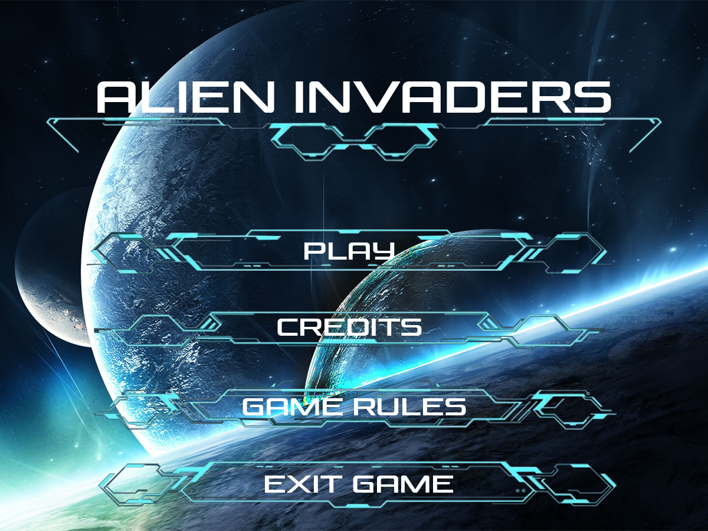
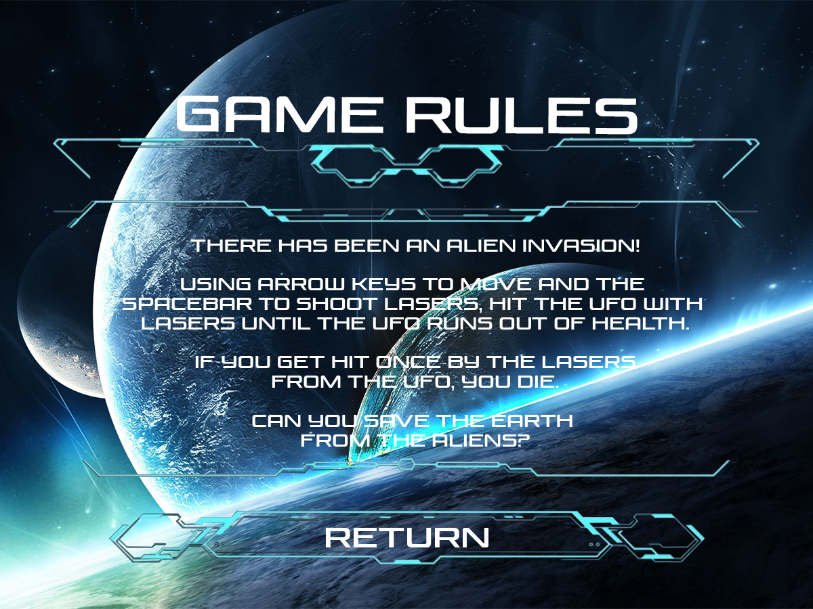

# Alien Invaders

A Space Invaders style boss fight written in Python. You pilot a lone spaceship at the bottom of the screen while a UFO sweeps back and forth above you, raining lasers. Land ten shots on the UFO to save Earth. Get hit once and it's over.

This was the first computer science project I ever made. I built it as the culminating project for my Grade 10 computer science class, using the `graphics.py` library we learned in class on top of Python's built-in `tkinter`.



## Stack

| Layer | Choice |
|---|---|
| Language | Python 3.8 or newer |
| Windowing and drawing | `tkinter` from the Python standard library |
| Graphics helper | John Zelle's `graphics.py`, bundled in the package |
| Packaging | `pyproject.toml` with setuptools |
| Third-party dependencies | None |

`graphics.py` is a small object-oriented wrapper around a `tkinter` canvas that ships with the textbook *Python Programming: An Introduction to Computer Science*. It is included in this repository so the game runs with nothing more than a standard Python install.

## Getting started

You need Python 3.8 or newer with `tkinter` available. The official installers for Windows and macOS include it. On Debian or Ubuntu, install it with `sudo apt install python3-tk`.

Clone the repository and install the package in editable mode:

```bash
git clone https://github.com/zacharyli293680/Grade-10-Culminating-Project.git
cd Grade-10-Culminating-Project
pip install -e .
```

Then start the game with either command:

```bash
alien-invaders
python -m alien_invaders
```

If you would rather not install anything, you can run it straight from the source folder:

```bash
cd src
python -m alien_invaders
```

The game opens in a 1200 by 900 window and does not resize, so it needs a display at least that large.

## How to play

**Controls**

| Key | Action |
|---|---|
| Left arrow | Move the spaceship left |
| Right arrow | Move the spaceship right |
| Space | Fire a laser |
| Mouse | Click the menu buttons |

Arrow keys can be held for continuous movement, and you can move and shoot at the same time. Only one of your lasers can be on screen at a time, so a shot has to land or fly off the top before you can fire again.

**Rules**

- The UFO glides left and right across the top of the screen and constantly drops red lasers straight down from wherever it is.
- The UFO starts with 100% health. Every laser you land takes off 10%, so ten hits win the game.
- One hit from a red laser destroys your ship and ends the game.
- The boss health bar and percentage sit at the top of the screen, and your score is in the top-left corner.

**Scoring**

- Each hit on the UFO is worth 100 points.
- Winning also awards a time bonus that starts at 3000 and drops by one point every frame, reaching zero after 60 seconds. The faster you win, the bigger the bonus.
- Your final score is shown on the win or lose screen.

## Screens

The game has six screens, each drawn as a full-window background image: the home menu, the game rules, the game itself, a win screen, a lose screen, and the credits.



## Project structure

```
.
├── README.md
├── pyproject.toml
└── src/
    └── alien_invaders/
        ├── __init__.py       # package entry, exposes main()
        ├── __main__.py       # lets `python -m alien_invaders` start the game
        ├── game.py           # all game logic: menus, input, movement, collisions, scoring
        ├── graphics.py       # Zelle's tkinter wrapper (bundled, unmodified)
        └── assets/
            ├── screens/      # full-window backgrounds for each menu and game state
            └── sprites/      # spaceship, UFO, and laser images
```

## How it works

The whole game is one loop that runs 50 times a second. Each pass it checks for mouse clicks and held keys, then does whatever the current game state calls for: waits for a menu click, or moves the ship, lasers, and UFO, checks for collisions, and updates the HUD. Menu buttons are rectangles of pixel coordinates matched against where the mouse was clicked. Collisions are simple bounding-box checks on the distance between two sprites. Every tunable value, from ship speed to the size of the time bonus, is a named constant at the top of `game.py`, so it's easy to tweak the feel of the game.

## Credits

- **Code, graphics, and testing:** Zach
- **Teacher:** Mr. Chow
- **Moral support:** Mike
- **graphics.py:** John Zelle, released under the GPL

## License

The game code and artwork are my own work from my Grade 10 class. The bundled `graphics.py` is copyright John Zelle and distributed under the GNU General Public License.
